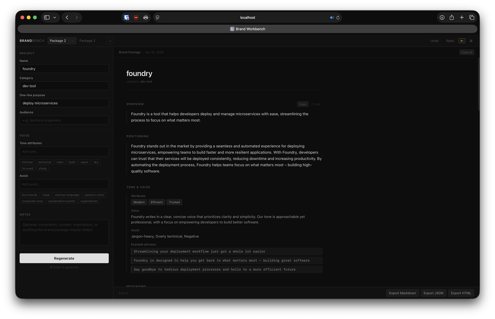

# Brand Bench

A client-side brand identity generator. Describe a project and get a complete
brand package — positioning, tone of voice, color palette, typography system,
logo concepts, taglines, and usage examples — instantly in the browser.

No backend. No accounts. Everything runs locally and persists in `localStorage`.



## Features

- **Template generation** — instant, offline-capable brand packages tailored by
  category (developer tool, creative studio, SaaS product, etc.)
- **AI generation** — connect your local [Ollama](https://ollama.com) instance
  for LLM-powered output; cancellable mid-stream
- **Multiple packages** — create, rename, duplicate, and switch between brand
  packages in tabs; each package is independently persisted
- **Inline editing** — click any field in the preview to edit it directly
- **Section locking** — lock sections before regenerating so they stay unchanged
  across runs
- **Undo / redo** — full edit history per package (`⌘Z` / `⌘⇧Z`)
- **Color palette** — editable swatches with a native color picker
- **Typography system** — curated font pairings per category with an 8-level
  type scale
- **Export** — download as Markdown, JSON, or a self-contained HTML guidelines page

## Getting started

```bash
npm install
npm run dev
```

Open `http://localhost:5173`.

To build for production:

```bash
npm run build      # outputs to dist/
npm run preview    # serve the build locally
```

## AI with Ollama

Brandbench can generate brand packages using a locally running Ollama model.

1. [Install Ollama](https://ollama.com/download) and pull a model:

   ```bash
   ollama pull llama3.2        # recommended default
   ollama pull mistral         # good alternative
   ollama pull gemma3          # another option
   ```

2. Make sure Ollama is running:

   ```bash
   ollama serve
   ```

3. If you're running Ollama on a non-default port or a different host, set the
   `OLLAMA_ORIGINS` environment variable to allow browser requests:

   ```bash
   OLLAMA_ORIGINS="*" ollama serve
   ```

4. Open Settings (⚙) in the app, enable AI, set your base URL
   (`http://localhost:11434` by default), select a model, and click **Test
   connection**.

Larger models produce better-structured output. If generation fails with a JSON
error, try a bigger model. Generation typically takes 15–60 seconds depending on
hardware.

## Self-hosting with Docker

A `Dockerfile` and `compose.yml` are included for deploying the app alongside
Ollama on a server.

```bash
docker compose up -d --build
```

The app is served on port 8000. Ollama's API is proxied through nginx at `/api/`
so the browser never makes a cross-origin request — no CORS configuration
needed.

**After first boot, pull at least one model:**

```bash
docker compose exec ollama ollama pull llama3.2
```

Then open the app, go to Settings (⚙), enable AI, and set the Ollama base URL
to `http://your-server:8000` (no path suffix).

**GPU support:** If your server has an NVIDIA GPU, uncomment the `deploy` block
in `compose.yml` (requires the
[NVIDIA Container Toolkit](https://docs.nvidia.com/datacenter/cloud-native/container-toolkit/install-guide.html)).

## Project structure

```
src/
  engine/
    generator.ts       # Template-based brand package generator
    aiGenerator.ts     # Ollama integration
  hooks/
    useWorkspace.ts    # Per-package state, generate, undo/redo
    usePackages.ts     # Multi-package tabs and localStorage slots
    useSettings.ts     # Ollama settings persistence
  components/
    InputPanel.tsx     # Project details form
    PreviewPanel.tsx   # Brand package preview with toolbar
    BrandDoc.tsx       # Full brand document (sections, palette, type scale)
    PackageSwitcher.tsx  # Tab bar with rename/duplicate/delete
    SettingsPanel.tsx  # AI settings drawer
  lib/
    sanitize.ts        # Defensive coercion for AI output fields
    export.ts          # Markdown / JSON / HTML export formatters
  types.ts             # All shared TypeScript interfaces
```

## Tech stack

- [React 18](https://react.dev) + [TypeScript](https://www.typescriptlang.org)
- [Vite](https://vitejs.dev)
- No UI library — plain CSS with custom properties

## License

MIT
